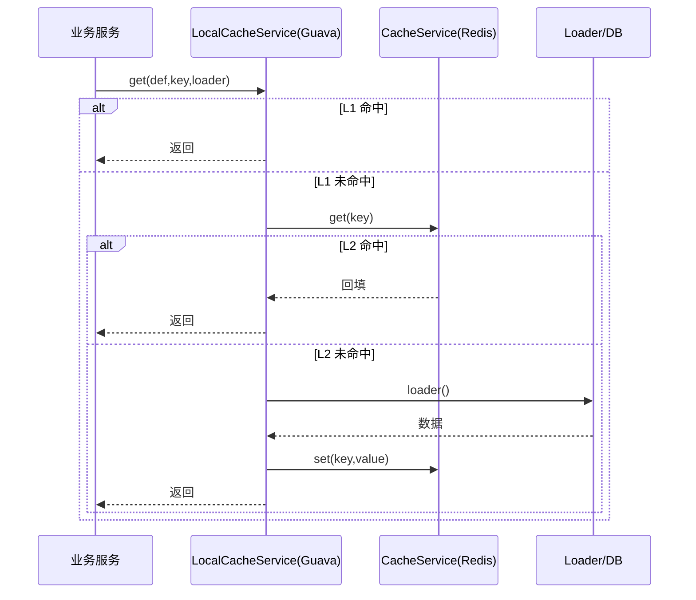
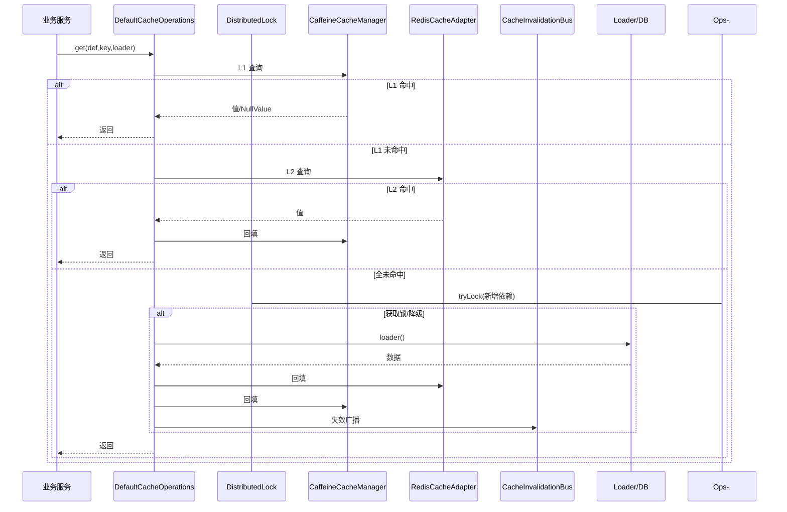
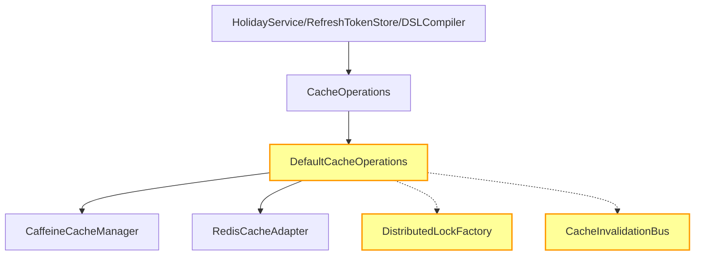

# 📋 Code Review Report

## 📌 Meta

| 字段 | 值 |
|---|---|
| 仓库 | `mediask-be` |
| 分支 | `development` |
| 日期 | `2026-03-04 21:52:10` |
| 审查范围 | 当前工作区所有未提交改动（`staged + unstaged + untracked`），重点为缓存体系重构与调用方适配 |
| 参与审查的角色 | `cr-architect`, `cr-senior-dev`, `cr-qa`, `cr-product` |
| 变更统计 | `28` 项工作区变更（含 `17` 个已跟踪文件 diff：`+181/-687`；另有 `11` 个 untracked 新文件） |

---

## 📊 审查总结

| 项目 | 结果 |
|---|---|
| 总体风险等级 | `High` |
| 审查结论 | `🔧 需要修改` |
| 发现统计 | `🚨 0 Blocker, 🔴 1 Critical, 🟠 4 Major, 🟡 3 Minor, 💡 1 Suggestion` |

**总体评价：**

> 本次缓存重构方向正确（两级缓存、空值缓存、TTL 抖动、Pub/Sub 失效广播、DSL 版本 INCR），并消除了旧 RedisTemplate 反序列化风险；但在缓存重建异常降级、本地缓存策略分流、Refresh Token 批量撤销边界、版本键脏值容错与测试覆盖方面仍有中高风险缺口，建议修复后再合入。

---

## 🔍 发现详情

### 🚨 Blocker（必须修复，阻断合并）

无

---

### 🔴 Critical（强烈建议修复）

#### [C-1] 缓存重建异常降级未回填缓存，可能持续放大击穿

- **严重度：** Critical
- **类别：** 并发/可用性
- **位置：** `mediask-infra/src/main/java/me/jianwen/mediask/infra/cache/DefaultCacheOperations.java:318` (`loadWithLock`)
- **审查角色：** `cr-architect`
- **置信度：** high

**问题代码：**
```java
} catch (Exception exception) {
    log.error("缓存加载异常，降级为直接调用 Loader: key={}", fullKey, exception);
    return loader.get();
}
```

**问题描述：**
异常路径直接调用 `loader.get()`，绕过了 `executeLoaderAndBackfill(...)`，导致故障期请求持续回源而不回填 L1/L2。

**影响分析：**
在 Redis/锁抖动时会把瞬时故障放大为持续未命中，显著增加 DB/下游压力并抬高 RT，存在级联风险。

**修复建议：**
异常降级也应走“加载并回填”路径，优先保证系统自恢复命中率。

```java
} catch (Exception exception) {
    log.error("缓存加载异常，降级为无锁加载并回填: key={}", fullKey, exception);
    return executeLoaderAndBackfill(definition, fullKey, loader);
}
```

**关联位置：**
- `mediask-infra/src/main/java/me/jianwen/mediask/infra/cache/DefaultCacheOperations.java:331` — 已有可复用回填封装

---

### 🟠 Major（建议修复）

#### [M-1] `LOCAL_ONLY` 缓存链路仍走分布式锁，造成额外远程依赖和性能回退

- **严重度：** Major
- **类别：** 架构/性能
- **位置：** `mediask-infra/src/main/java/me/jianwen/mediask/infra/cache/DefaultCacheOperations.java:243` (`doGet`)；`mediask-infra/src/main/java/me/jianwen/mediask/infra/cache/DefaultCacheOperations.java:296` (`loadWithLock`)
- **审查角色：** `cr-architect`, `cr-product`
- **置信度：** high

**问题代码：**
```java
// ---- Step 3: 全部未命中，加分布式锁回源加载 ----
return loadWithLock(definition, fullKey, remoteRead, loader);
```

**问题描述：**
当前未按缓存层级分流，`LOCAL` 场景（如编译结果缓存）未命中后仍进入 Redis/Redisson 分布式锁路径。

**影响分析：**
本地缓存场景在 Redis 不稳时被连带影响；冷启动/高并发下引入不必要网络 I/O，削弱重构收益。

**修复建议：**
按 `definition.hasRemoteLevel()` 分流：仅 `REMOTE/TWO_LEVEL` 走分布式锁；`LOCAL` 使用进程内 single-flight 或无锁回源并回填。

**关联位置：**
- `mediask-domain/src/main/java/me/jianwen/mediask/domain/cache/CacheLevel.java:16` — `LOCAL` 语义为进程内缓存
- `mediask-infra/src/main/java/me/jianwen/mediask/infra/schedule/engine/dsl/ConstraintDslCompiler.java:35` — `compiled-dsl` 已声明 `localOnly`

---

#### [M-2] Refresh Token 全量撤销采用模式扫描，且命名空间治理不一致

- **严重度：** Major
- **类别：** 可扩展性/数据边界
- **位置：** `mediask-infra/src/main/java/me/jianwen/mediask/infra/security/RefreshTokenStore.java:32`；`mediask-infra/src/main/java/me/jianwen/mediask/infra/security/RefreshTokenStore.java:84` (`revokeAll`)
- **审查角色：** `cr-architect`, `cr-product`
- **置信度：** high

**问题代码：**
```java
private static final String KEY_PREFIX = "auth:refresh:";
...
String pattern = KEY_PREFIX + userId + ":*";
long deletedCount = redisCacheAdapter.deleteByPattern(pattern);
```

**问题描述：**
`revokeAll` 仍依赖 `SCAN + UNLINK` 全模式扫描，且 key 前缀未纳入统一全局命名空间治理，和缓存新架构的键治理策略不一致。

**影响分析：**
键规模增长时登出全设备延迟不稳定；共享 Redis 场景存在误匹配/误删边界风险。

**修复建议：**
引入用户维度 token 索引（`Set`）做定点删除，并统一应用级命名空间（或独立 TokenKeyGenerator）。

**关联位置：**
- `mediask-infra/src/main/java/me/jianwen/mediask/infra/cache/RedisCacheAdapter.java:153` — 模式删除实现为扫描模型
- `mediask-infra/src/main/java/me/jianwen/mediask/infra/cache/CacheKeyGenerator.java:31` — 缓存键已有全局前缀策略

---

#### [M-3] DSL 版本键存在脏值时 `INCR` 会失败，发布/回滚链路可被阻断

- **严重度：** Major
- **类别：** 回归风险/健壮性
- **位置：** `mediask-infra/src/main/java/me/jianwen/mediask/infra/schedule/engine/dsl/ConstraintDslVersionManager.java:58` (`bumpVersion`)
- **审查角色：** `cr-qa`
- **置信度：** high

**问题代码：**
```java
public long bumpVersion(String namespace, Long departmentId) {
    return redisCacheAdapter.increment(versionKey(namespace, departmentId));
}
```

**问题描述：**
如果历史脏数据将版本键写为非整数，`INCR` 会直接报错，缺少自愈/兜底。

**影响分析：**
规则发布/回滚可能在版本递增处失败，导致新规则无法生效并带来多实例规则不一致窗口。

**修复建议：**
递增前校验键值；非法值重置或删除后再 `INCR`，并记录告警日志追溯污染来源。

**关联位置：**
- `mediask-service/src/main/java/me/jianwen/mediask/service/application/service/ScheduleRuleProfileApplicationService.java:87` — 发布/回滚链路依赖 `bumpVersion`

---

#### [M-4] `ConstraintDslCompiler` 改造后的关键缓存语义测试不足

- **严重度：** Major
- **类别：** 测试覆盖
- **位置：** `mediask-infra/src/test/java/me/jianwen/mediask/infra/schedule/engine/dsl/ConstraintDslCompilerTest.java:42`
- **审查角色：** `cr-senior-dev`
- **置信度：** high

**问题代码：**
```java
when(cacheOperations.get(any(), anyString(), any(Class.class), any())).thenAnswer(invocation -> {
    Supplier<Object> loader = invocation.getArgument(3, Supplier.class);
    return loader.get();
});
```

**问题描述：**
测试通过 mock 直接调用 loader，未覆盖“版本号参与 key、命中复用、版本变更失效”这些本次重构核心行为。

**影响分析：**
缓存 key 维度错误或版本失效失灵时，现有测试无法提前拦截回归。

**修复建议：**
补充至少三类用例：相同请求命中复用、版本变更触发重编译、默认 DSL 与显式 DSL 的 key 维度断言。

---

### 🟡 Minor（可选优化）

#### [m-1] `mediask-infra` 模块保留未使用的 Guava 依赖

- **严重度：** Minor
- **类别：** 依赖治理
- **位置：** `mediask-infra/pom.xml:109`
- **审查角色：** `cr-senior-dev`

**问题描述：**
`GuavaLocalCacheService` 删除后，`com.google.guava:guava` 仍保留，当前变更范围未见实际引用。

**修复建议：**
若无短期计划，移除该依赖并减少后续安全/升级维护成本。

---

#### [m-2] `HolidayService` 存在未使用配置项 `holidayApiKey`

- **严重度：** Minor
- **类别：** 死代码/可维护性
- **位置：** `mediask-infra/src/main/java/me/jianwen/mediask/infra/holiday/HolidayService.java:51`
- **审查角色：** `cr-senior-dev`

**问题描述：**
`holidayApiKey` 被注入但未在任何逻辑中使用，容易误导维护者。

**修复建议：**
未接入外部 API 鉴权前先移除；若即将接入，补齐 `syncHolidays()` 实际使用与测试。

---

#### [m-3] `isHoliday` 对空入参无防护，可能触发 NPE

- **严重度：** Minor
- **类别：** 边界条件
- **位置：** `mediask-infra/src/main/java/me/jianwen/mediask/infra/holiday/HolidayService.java:132`
- **审查角色：** `cr-qa`

**问题描述：**
`dateKey(date)` 内部直接 `date.toString()`，当上游传入 `null` 会抛空指针。

**修复建议：**
在入口统一做 `date` 非空校验，按约定返回参数异常或 `false`。

---

### 💡 Suggestion（改进建议）

#### [S-1] `DefaultCacheOperations` 职责过重，建议拆分内部协作组件

- **类别：** 可维护性/架构演进
- **位置：** `mediask-infra/src/main/java/me/jianwen/mediask/infra/cache/DefaultCacheOperations.java:51`
- **审查角色：** `cr-architect`

**建议内容：**
当前单类同时承担读链路、锁控制、回填、空值策略、抖动、失效广播等职责。建议逐步拆为读编排、写协调、重建守卫、失效协调等组件，`DefaultCacheOperations` 仅保留门面角色，降低后续策略演进的改动冲击面。

---

## 💥 影响分析

### 🔗 受影响的上下游模块

| 模块/文件 | 影响方式 | 风险程度 |
|---|---|---|
| `mediask-infra/src/main/java/me/jianwen/mediask/infra/cache/DefaultCacheOperations.java` | 统一缓存读写核心路径变化，影响所有接入 `CacheOperations` 的业务 | high |
| `mediask-infra/src/main/java/me/jianwen/mediask/infra/holiday/HolidayService.java` | 节假日查询从旧缓存接口迁移到两级缓存抽象 | medium |
| `mediask-infra/src/main/java/me/jianwen/mediask/infra/security/RefreshTokenStore.java` | Token 存储与批量撤销逻辑改造 | medium |
| `mediask-infra/src/main/java/me/jianwen/mediask/infra/schedule/engine/dsl/ConstraintDslCompiler.java` | DSL 编译缓存由旧本地缓存接口迁移到新抽象 | medium |
| `mediask-infra/src/main/java/me/jianwen/mediask/infra/schedule/engine/dsl/ConstraintDslVersionManager.java` | 版本号并发语义切换为原子 `INCR` | medium |

### ⚠️ 回归风险评估

主要回归风险集中在缓存未命中重建路径和版本键脏值场景。若不修复 Critical/Major 项，可能出现：缓存命中率劣化导致下游压力升高、规则发布失败、登出全设备路径性能抖动。其余风险可通过补充针对性测试与键治理策略逐步收敛。

---

## 🗺️ 架构与流程图

### 变更前后调用链对比

**变更前：**


**变更后：**


### 模块依赖关系



---

## ✅ 审查覆盖度

| 审查维度 | 状态 | 说明 |
|---|---|---|
| 架构设计与分层 | ⚠️ 已审查-有发现 | 本地缓存路径仍耦合分布式锁 |
| 高内聚低耦合 | ⚠️ 已审查-有发现 | `DefaultCacheOperations` 职责集中 |
| 单一职责原则 | ⚠️ 已审查-有发现 | 建议组件化拆分 |
| 设计模式合理性 | ✅ 已审查-无问题 | 统一门面抽象方向合理 |
| 并发与分布式安全 | ⚠️ 已审查-有发现 | 锁异常降级不回填；版本键脏值容错缺失 |
| 死代码 | ⚠️ 已审查-有发现 | Guava 依赖、`holidayApiKey` 未使用 |
| 代码风格规范 | ✅ 已审查-无问题 | 风格整体一致 |
| DRY（代码重复） | ✅ 已审查-无问题 | 未见明显重复新增 |
| 代码复杂度 | ⚠️ 已审查-有发现 | 缓存核心类复杂度偏高 |
| 命名与注释 | ⚠️ 已审查-有发现 | RefreshToken 注释与前缀治理实现不一致 |
| 异常处理 | ⚠️ 已审查-有发现 | 异常降级策略可导致持续回源 |
| 空指针/None 安全 | ⚠️ 已审查-有发现 | `isHoliday(null)` 边界未处理 |
| 逻辑错误与死循环 | ✅ 已审查-无问题 | 未见确定性死循环/显著逻辑错 |
| 边界情况 | ⚠️ 已审查-有发现 | Redis 脏值与空入参场景 |
| 回归风险 | ⚠️ 已审查-有发现 | 缓存与发布链路存在中高风险点 |
| 上下游影响 | ⚠️ 已审查-有发现 | 影响所有新接入 `CacheOperations` 业务 |
| 输入验证 | ⚠️ 已审查-有发现 | 日期参数缺少非空校验 |
| 安全（注入攻击） | ✅ 已审查-无问题 | 未发现新增注入面 |
| 安全（认证授权） | ✅ 已审查-无问题 | 认证授权链路未见新增绕过 |
| 安全（敏感数据） | ✅ 已审查-无问题 | 未发现新增敏感信息泄露 |
| 需求完整性 | ⚠️ 已审查-有发现 | 重构后部分关键行为未被测试锁定 |
| 遗漏场景 | ⚠️ 已审查-有发现 | 本地缓存/脏值/批量撤销边界遗漏 |
| 数据库查询效率 | ✅ 已审查-无问题 | 本次改动未引入 DB 查询退化证据 |
| Redis 使用 | ⚠️ 已审查-有发现 | 模式删除与本地场景远程锁开销 |
| 批量操作 | ⚠️ 已审查-有发现 | `revokeAll` 扫描模型可扩展性一般 |
| 同步/异步 | ✅ 已审查-无问题 | 未见新增异步模型风险 |
| 性能瓶颈 | ⚠️ 已审查-有发现 | `LOCAL` 场景额外分布式锁路径 |

---

## ❓ 需进一步确认的问题

| # | 问题 | 位置 | 说明 |
|---|---|---|---|
| 1 | RefreshToken 是否计划与缓存键统一前缀策略完全对齐 | `mediask-infra/src/main/java/me/jianwen/mediask/infra/security/RefreshTokenStore.java:30` | 注释写明“由 CacheKeyGenerator 统一前缀”，但当前实现未体现 |

---

## 📝 后续跟进事项

- [ ] 修复 `loadWithLock` 异常降级回填缺失（Critical）并补充并发回归测试
- [ ] 按缓存层级分流本地/远程重建策略，避免 `LOCAL` 场景走分布式锁
- [ ] 收敛 RefreshToken 键治理与批量撤销方案（索引化删除）
- [ ] 为 DSL 版本脏值增加自愈逻辑并补充异常路径测试
- [ ] 补齐 `ConstraintDslCompiler` 缓存语义测试；清理无用依赖与无用字段

---

*本报告由 OpenCode Code Review Skill 自动生成，审查角色：cr-architect, cr-senior-dev, cr-qa, cr-product*
